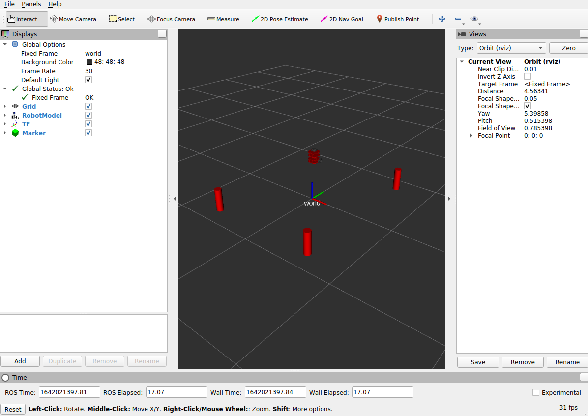

# nusim
By Marco Morales

## Overview
The nusim package allows the simulation of a turtlebot3 that can be viewed in RVIZ. In this simulation, there are a number of obstacles in the environment that are presented as red cylinders.

An important thing to note is that the user can change the parameters of the simulation by editing the basic_world.yaml.

### Parameters
There are a number of parameters that can be changed in the basic_world.yaml file.

1. `radius`
The radius parameter sets the radius of the obstacles in the simulation.
2. `rate`
Rate changes the frequency at which the main loop runs.
3. `cylinders_x_coord`
This parameter sets the x coordinates of the cylinders where the first, second and third values changes the corresponding cylinder's x coordinate.
4. `cylinders_y_coord`
Similar to the previous parameter, this sets the corresponding y coordinate of the cylinders. 
5. `robot`
The robot parameter is made of 3 coordinates, x,y, and theta, to set the starting position of the turtlebot.

### Launchfile
The launchfile, `nusim.launch`, is the main launchfile for the package and it runs the simulation node, `nusim.cpp`, RVIZ, and loads the yaml file for the parameters. There are arguments within the launchfile that the user can define when running the launchfile.

To run the launchfile, run the following line.
`roslaunch nusim nusim.launch`

There is only one argument, which is color and this sets the color of the robot. For this assignment, only red is used and therefre the default is red. 
`roslaunch nusim nusim.launch color:=red`

### Services
There are two services that can be called in the package.

The first service is `reset`. This service sets the timestep to 0 and sets the turtlebot's position to (0,0,0). To call the service, see below.
```
rosservice call /nusim/reset
```

The next service is 'teleport' and it moves the position of the turtlebot where the user set when calling the service.
below.
```
rosservice call /nusim/teleport "x: 0.0
y: 0.0
theta: 0.0" 
```


### Image of the simulation


