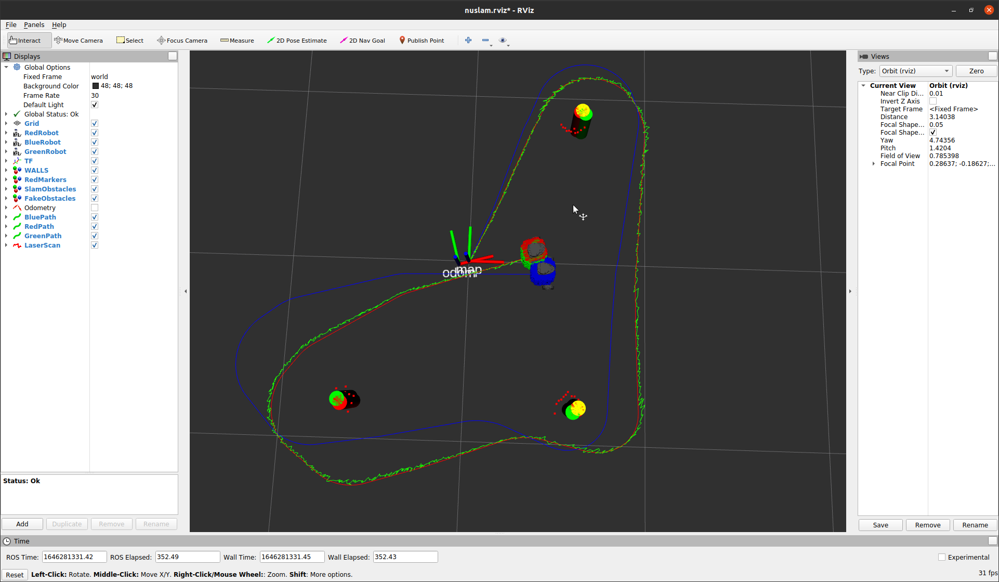
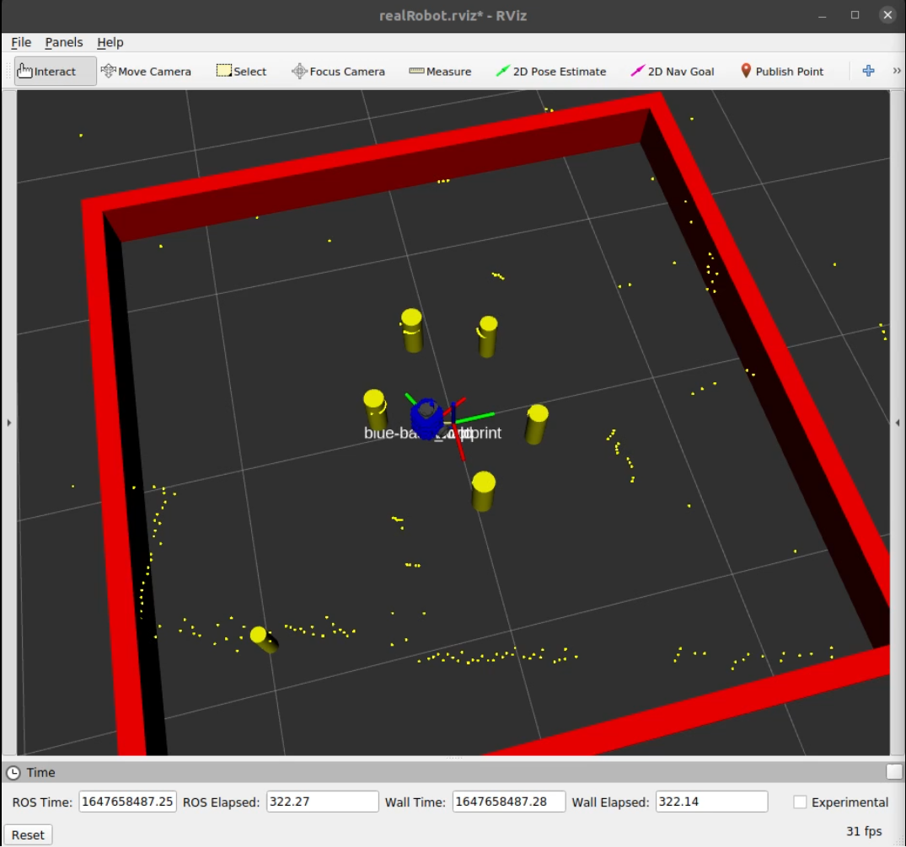

# nuslam
By Marco Morales

## OVERVIEW
The nuslam package allows the use of the Extended Kalman Filter on the Turtlebot3 to estimate its distance as well as estimate the location of obstacles/landmarks in the map.

## Nodes

The the main node in this package is the slam node.

The slam node implements the Extended Kalman Filter SLAM. It reads the obstacle data being published by the nusim node to calculate the position of the Turtlebot as well as the obstacles' locations. It then publishes a MarkerArray message of where the markers are located based on the EKF filter. 

For the nuslam node, there are two libraries that it uses that are both located in the package. This is the nuslam library which has the equations for an Extended Kalman Filter and the other library is the CircleFitting library. In the CircleFitting library,it is used for determining if clusters form a true circle, which is done in ClassifyCircles and if it does, then it will output the location of the circle as well as the radius which is handled in CircleFitting.

For nuslam, two methods of Data Association were attempted but not with accurate results.

The other node that was implemented was landmarks.cpp. This node subscribes to laser scan data, whether is be real or simulated, and it creates obstacles based on Circle Fitting and Circle Classification algorithms. 

## Launchfiles

The main launchfile for this package is `slam.launch`.

This launch file can be called by running the following command.
```
roslaunch nuslam slam.launch
```

The other launchfile for this package is `landmarks_detect.launch`. It can be run in simulation or the real robot.

This launch file can be called by running the following command.
```
roslaunch nuslam landmarks_detect.launch
```

The launch files have a few arguments that be changed. They are as follows.

1. robot

To run with nusim in a simulated environment, use `robot:=nusim` which is the default.

2. cmd_src

To control the robot with your keyboard, set the argument to `cmd_src:=teleop`, otherwise use `cmd_src:=circle` to control the robot with the circle node. 

3. use_rviz

To use RVIZ, set the argument to true such as the following `use_rviz:=true`.

4. config_file

To specify which config file to use with different parameters for noise or laser scan parameters, set this argument to the name of that file such as `config_file:=default_config.yaml`.

## Results
Parameters
Obstacle noise standard deviation: 0.01
Wheel Slip noise: 0.1
Wheel_cmd noise: 0.1
Laser noise: 0.01





Video of the turtlebot moving in turtle land and seeing obstacles in real life.

https://youtu.be/13grzbBxwfE>

Video of the turtlebot moving in turtle land and seeing obstacles in RVIZ.

https://youtu.be/jGN4xyfuN_s

Video of the turtlebot being surrounded by and seeing obstacles in real life.

https://youtu.be/J7Vot6esoKY

Video of the turtlebot being surrounded by and seeing obstacles in RVIZ.

https://youtu.be/r1sbA5DxFAY